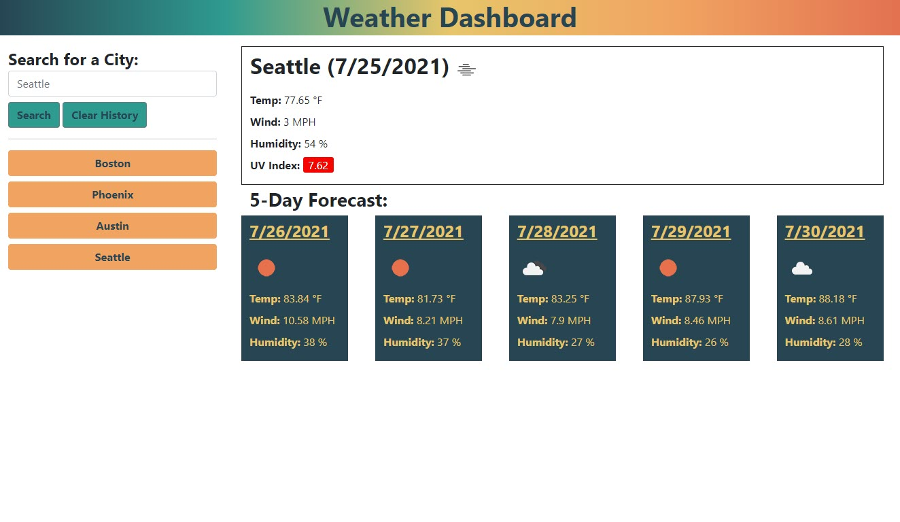

# Weather-Dashboard

## Description

This Weather Dashboard application allow users to search for current and 5-day forecast weather for a target city. As searches are performed, search history is compiled, allowing the user to easily return to the weather for a previously searched city. The application showcases the ability to query a third-party API (OneWeather) for information to populate the dashboard using dynamically generated HTML.

## Usage

[Weather Dashboard](https://michaelhermes.github.io/Weather-Dashboard/)

The user is able to enter a city name into the search form and upon clicking "Search", they are presented with current and 5-day forecast weather for that city. The city name will be added to the user's search history, which they can then click on for easy access to previously searched cities. The search history is persisted into local storage and is pre-populated anytime the dashboard is initially loaded.

